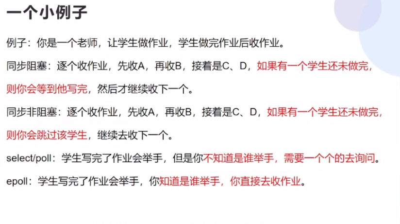

## 各种设计模式
1. 工厂模式（factory pattern）

定义一个创建对象的接口，让其子类自己决定实例化哪一个工厂类，工厂模式使其创建过程延迟到子类进行。

2. 单例模式


3. 观察者模式

https://www.runoob.com/design-pattern/design-pattern-tutorial.html

##  什么是观察者模式
观察者模式是一种对象行为模式。它定义对象间的一种一对多的依赖关系，当一个对象(目标对象)的状态发生改变时，所有依赖于它的对象(观察对象)都得到通知并被自动更新。特点：被观察者和观察者一般是一对多的关系，一个被观察者对应多个观察者，当一个被观察者的状态发生改变时，被观察者通知观察者，然后可以在观察者内部进行业务逻辑的处理。


## MVC开发模型
把代码按照功能分为三层，即模型层(Model)、显示层(View)、控制层(Controller)，这种代码的组织架构就叫MVC模式


## 六大进程通信机制原理
1. 管道
2. 消息队列
3. 共享内存
4. 信号量
5. 信号
6. socket


## 什么是RPC
RPC（Remote Procedure Call）远程过程调用协议，一种通过网络从远程计算机上请求服务，而不需要了解底层网络技术的协议。RPC它假定某些协议的存在，例如TPC/UDP等，为通信程序之间携带信息数据。在OSI网络七层模型中，RPC跨越了传输层和应用层，


## 五层模型
**表示层**：解决不同主机的通信的数据格式问题

**会话层**：建立和管理应用程序之间的通信（连接）（对下层的封装） 方便用户使用，自动收发包 报文

---

**传输层**：拆包组包 TCP：保证数据包的完整性 和 以及处理传输过程中可能发生的危险 UDP：发完就完了 报文----拆分成---->包

**网络层**：路由和地址解析。选择适当的网络节点进行路由。 包 ---->数据帧

**数据链路层**：控制对物理设备的访问 规定数据如何在不同物理设备上进行传出 并提供数据纠错功能。在不可靠的物理设备上提供可靠传输 数据数据帧

**物理层**：定义通信的物理设备的规格。网线接口类型，光纤接口类型，传输速率等


## 不同产品所处于的层
0. Socket：套接字编程，的确没听说socket对应某个协议，这只是网络编程的一个api套件，实际对应**传输层**及以上的东西
1. RPC：跨越了传输层和应用层，
2. TCP：传输层
3. HTTP：应用层
4. 路由器：网络层
5. 三层交换机：网络层


## TCP、HTTP、SOCKET之间的关系

socket 本身不是协议，它是一个应用程序与网络之间的接口的api，是面向编程人员,进程或线程通过它来向网络发送报文。
**socket 实际上是对传输层（TCP/UDP …)接口的封装：** 它并不实际控制传输层，对传输层的影响仅有一下两方面：
- 选择传输协议：TCP/UDP
- 设置一些传输参数：如报文最大长度等

---

TCP是传输层的一种协议，为进程提供传输可靠的数据传输服务

HTTP假设在TCP的上层，是应用层一种协议，需要先建立TCP连接才能进行HTTP,为web应用程序提供数据传输服务

关于TCP/IP和HTTP协议的关系，网络有一段比较容易理解的介绍：

我们在传输数据时，可以只使用(传输层)TCP/IP协议，但是那样的话，如果没有应用层，便无法识别数据内容。如果想要使传输的数据有意义，则必须使用到应用层协议。


## HTTP 1.0 1.1 2.0
### HTTP1.0
1. 浏览器与服务器只保持短暂的连接，浏览器的每次请求都需要与服务器建立一个TCP连接

### HTTP1.1
1. 引入了持久连接，即TCP连接默认不关闭，可以被多个请求复用
2. 在同一个TCP连接里面，客户端可以同时发送多个请求
3. 虽然允许复用TCP连接，但是同一个TCP连接里面，所有的数据通信是按次序进行的，服务器只有处理完一个请求，才会接着处理下一个请求。如果前面的处理需要时间特别长特别慢，后面的请求只能排队等着
4. 新增了一些请求方法put、delete、options
5. 新增了一些请求头和响应头

### HTTP2.0
1. 采用二进制格式而非文本格式
2. 完全多路复用，而非有序并阻塞的、只需一个连接即可实现并行
3. 使用报头压缩，降低开销
4. 服务器可以推送

## HTTP1.1 的Keep-Alive
Keep-Alive 是使用同一个 TCP 连接来发送和接收多个 HTTP 请求/应答，而不是为每一个新的请求/应答打开新的连接的方法。

我们知道 HTTP 协议采用“请求-应答”模式，当使用普通模式，即非 Keep-Alive 模式时，每个请求/应答客户和服务器都要新建一个连接，完成 之后立即断开连接（ HTTP 协议为无连接的协议）；

当使用 Keep-Alive 模式（又称持久连接）时，Keep-Alive 功能使客户端到服 务器端的连接持续有效，当出现对服务器的后继请求时，Keep-Alive 功能避免了建立或者重新建立连接。


## HTTP2.0 连接多路复用

HTTP 1.1 虽然解决了多次连接的问题，但是它存在一个致命的缺陷，效率低下。

HTTP 1.1 串行的文件传输。当请求 a 文件时，b 文件只能等待，等待 a 连接到服务器、服务器处理文件、服务器返回文件，这三个步骤。我们假设这三步用时都是1秒，那么 a 文件用时为3秒，b 文件传输完成用时为6秒，依此类推。（注：此项计算有一个前提条件，就是浏览器和服务器是单通道传输）

HTTP 2.0的复用连接，虽然依然遵循请求-响应模式，但客户端发送多个请求和服务端给出多个响应的顺序不受限制，这样既避免了"队头堵塞"，又能更快获取响应。在复用同一个 TCP 连接时，服务器同时(或先后)收到了 A、B 两个请求，先回应A请求，但由于处理过程非常耗时，于是就发送A请求已经处理好的部分， 接着回应B请求，完成后，再发送A请求剩下的部分。HTTP 2.0长连接可以理解成全双工的协议。

因为HTTP 2.0引入二进制数据帧和流的概念，其中帧对数据进行顺序标识，也就是说，我们传递一个字符串的时候，比如说，我要传递一个，“别说了，我爱你”，HTTP 1.1是按照一个顺序传输，那么 HTTP 2.0是怎么

## 同步阻塞 同步非阻塞 select poll epoll 



同步非阻塞流程是
1. 用户空间发送带有 fd 的IO请求到内核空间
2. 内核空间将 fd 添加到 fd_set，轮询fd_set，如果该 fd 已经准备就绪就发送正确的 fd（>0）
3. 如果对应的fd 没有准备就绪，内核空间发送错误码（<0）返回给用户空间
4. 用户空间收到错误码之后重新发送IO 请求
5. 内核空间重复上面的操作，直到fd 准备就绪返回正确结果或者 IO 超时

这个过程多次切换 用户态和内核态

## HTTPS SSL/TLS加密过程


## linux 命令

1. Linux查看最后100行日志
tail -n 100 /path/to/file

2. Linux实时查看日志
tail -f


## golang GC
- Go 1：串行三色标记清扫
- Go 1.3：并行清扫，标记过程需要 STW，停顿时间在约几百毫秒
- Go 1.5：并发标记清扫，停顿时间在一百毫秒以内
- Go 1.6：使用 bitmap 来记录回收内存的位置，大幅优化垃圾回收器自身消耗的内存，停顿时间在十毫秒以内
- Go 1.7：停顿时间控制在两毫秒以内
- Go 1.8：混合写屏障，停顿时间在半个毫秒左右
- Go 1.9：彻底移除了栈的重扫描过程
- Go 1.12：整合了两个阶段的 Mark Termination，但引入了一个严重的 GC Bug 至今未修（见问题 20），尚无该 Bug 对 GC 性能影响的报告
- Go 1.13：着手解决向操作系统归还内存的，提出了新的 Scavenger
- Go 1.14：替代了仅存活了一个版本的 scavenger，全新的页分配器，优化分配内存过程的速率与现有的扩展性问题，并引入了异步抢占，解决了由于密集循环导致的 STW 时间过长的问题

## python GIL全局解释性锁


## GMP 调度模型


只需要维护一个总协程队列，再有个线程就能调度这些协程了呗，Go语言v1.0确实就是这么设计的

但是要知道Go语言服务通常会有多个线程，多个线程从全局协程队列获取可运行协程时候，是不是就需要加锁呢？加锁就意味着低效。

  所以后面引入了P（P就只是一个由很多字段的数据结构而已，可以将P理解成为一种资源），一般P的数目会和系统CPU核数保持一致，；M想要调度协程，需要获取并绑定P，P只能被一个M占有，每个P都维护有协程队列，那这时候线程M调度协程，是不是只需要从当前绑定的P获取即可，也就不需要加锁了。

另外，为了避免多个P负载分配不均衡，还有一个全局队列sched.runq（协程有些情况会添加到全局队列），如果当前P的协程队列为空，M还可以从全局队列查找可运行G，当然这时候就需要加锁了。

G要并发执行，肯定涉及到调度，调度就得像线程一样，要保护调度现场， 用的是虚拟内存结构，虚拟内存被划分为代码段，数据段，堆，共享区，栈，内核区域。malloc分配的内存通常就在堆区，既然操作系统没办法为我们维护协程栈，那我们自己malloc一块内存，将其用作协程栈不就行了。
https://segmentfault.com/a/1190000042529964?sort=votes


## Redis 数据丢失
异步复制导致的数据丢失。因为master->slave的复制是异步的，所以可能有部分数据还没复制到slave，master就宕机了，此时这些部分数据就丢失了。

脑裂导致的数据丢失。某个master所在机器突然脱离了正常的网络，跟其他slave机器不能连接，但是实际上master还运行着。此时哨兵可能就会认为master宕机了，然后开启选举将其他slave切换成了master。集群里就会有两个master，也就是所谓的脑裂。

此时虽然某个slave被切换成了master，但是可能client还没来得及切换到新的master，还继续写向旧master的数据可能也丢失了。因此旧master再次恢复的时候，会被作为一个slave挂到新的master上去，自己的数据会清空，重新从新的master复制数据。

解决方案：
通过在redis.conf配置控制同步时间减少数据丢失.
```
# 要求至少有1个slave，数据复制和同步延迟不能超过10秒
min-slaves-to-write 1
 
# 如果说一旦所有的slave，数据复制和同步的延迟都超过了10秒钟，那么master就会拒绝接收任何请求
min-slaves-max-lag 10
```


## 死锁的四个必要条件
1、互斥条件：一个资源每次只能被一个进程使用；

2、请求与保持条件：一个进程因请求资源而阻塞时，对已获得的资源保持不放；

3、不剥夺条件:进程已获得的资源，在末使用完之前，不能强行剥夺；

4、循环等待条件:若干进程之间形成一种头尾相接的循环等待资源关系；

## Go 语言 map 是并发安全的吗？
https://blog.csdn.net/zyx6a/article/details/130897519

⭐️⭐️⭐️分片加锁，给map分区，把锁粒度变小


## Mutex 正常模式和饥饿模式
### 正常模式（非公平锁）

正常模式下，所有等待锁的 goroutine 按照 FIFO（先进先出）顺序等待。唤醒
的 goroutine 不会直接拥有锁，而是会和新请求 goroutine 竞争锁。新请求的goroutine 更容易抢占：因为它正在 CPU 上执行，所以刚刚唤醒的 goroutine有很大可能在锁竞争中失败。在这种情况下，这个被唤醒的goroutine 会加入到等待队列的前面。

### 饥饿模式（公平锁）
为了解决了等待 goroutine 队列的长尾问题饥饿模式下，直接由 unlock 把锁交给等待队列中排在第一位的goroutine (队 头)，同时，饥饿模式下，新进来的goroutine 不会参与抢锁也不会进入自旋状
态，会直接进入等待队列的尾部。这样很好的解决了老的goroutine 一直抢不
到锁的场景。饥饿模式的触发条件：当一个 goroutine 等待锁时间超过 1 毫秒时，或者当前队列只剩下一个 goroutine 的时候，Mutex 切换到饥饿模式。

## Go goroutine的发展

在 1.14 版本之前，程序只能依靠 Goroutine 主动让出 CPU 资源才能触发调
度。这种方式存在问题有：

⚫ 某些 Goroutine 可以长时间占用线程，造成其它 Goroutine 的饥饿

⚫ 垃圾回收需要暂停整个程序（Stop-the-world，STW），最长可能需要几分
钟的时间，导致整个程序无法工作

## Golang--sync.Pool 有什么用
对于很多需要重复分配、回收内存的地方，sync.Pool 是一个很好的选择。频繁地分配、回收内存会给 GC 带来一定的负担，严重的时候会引起 CPU的毛刺。而 sync.Pool 可以将暂时将不用的对象缓存起来，待下次需要的时候直接使用，不用再次经过内存分配，复用对象的内存，减轻 GC 的压力，提升系
统的性能。

## 虚拟化技术是什么
实质的效果是，虚拟化技术允许你在一个硬件平台下运行 2 个完全不同的操作系统。每个客户操作系统可完成像系统自检、启动、载入系统内核等像在独立硬件上的一切动作。同时也具备坚实的安全基础，例如，客户操作系统不能获取完全访问主机或其它客户系统的权限，及其它涉及安全，可能把系统搞坏的操作。

主要的有如下 3 种虚拟化技术种类
- 全模拟（Emulation） 
- 半虚拟（Paravirtualization） 
- 基于容器的虚拟化（Container-based virtualization）

##     9、事务隔离级别
1. 隔离级别 ---脏读  不可重复读   幻读
2. 读未提交-----是-----是------是
  
3. 不可重复读---否-----是-----是
   
4. 可重复读-----否-----否-----是
5. 串行化-------否-----否-----否

